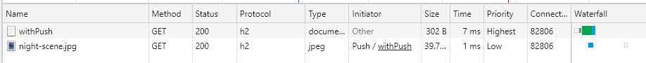

# Demo Spring boot with Http/2

## Prerequisites
- JDK 9
- [SSL config](https://docs.spring.io/spring-boot/docs/2.0.6.RELEASE/reference/html/howto-embedded-web-servers.html#howto-configure-ssl)

## Test

## References
- [HTTP/1.1 vs HTTP/2: What's the Difference?](https://www.digitalocean.com/community/tutorials/http-1-1-vs-http-2-what-s-the-difference)
- [HTTP/2: A jump-start for Java developers](https://www.infoworld.com/article/2916548/http-2-for-java-developers.html)